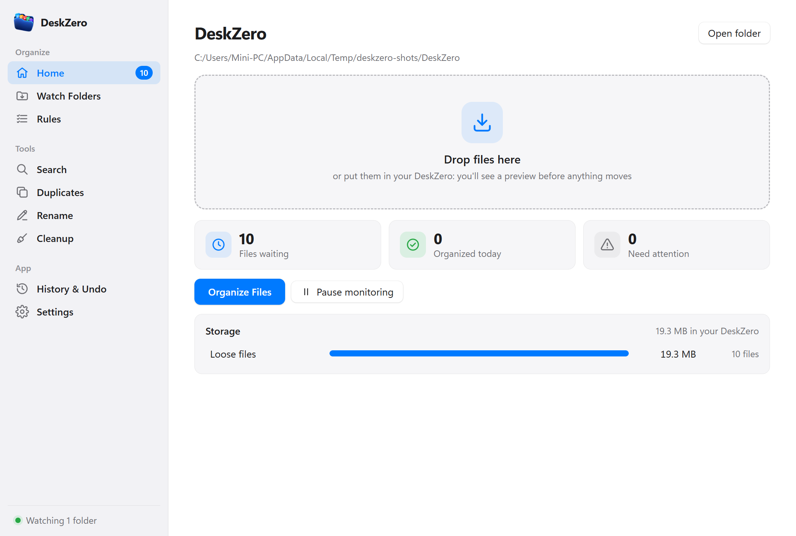
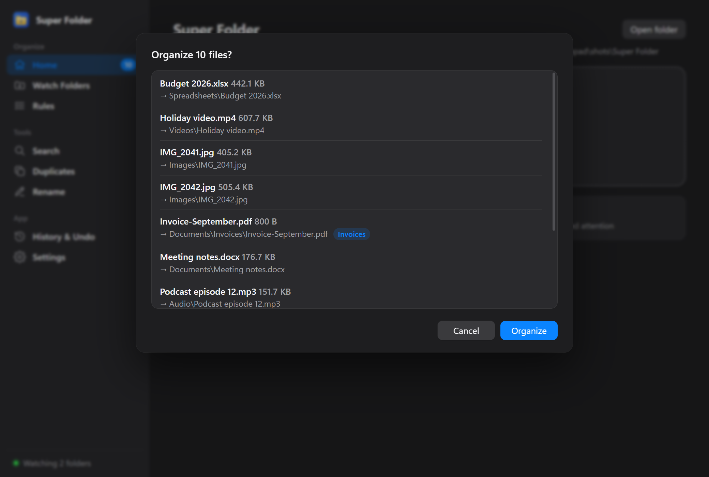
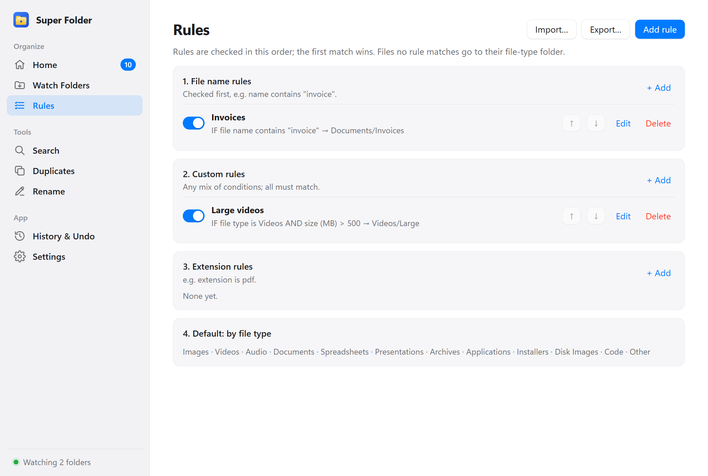
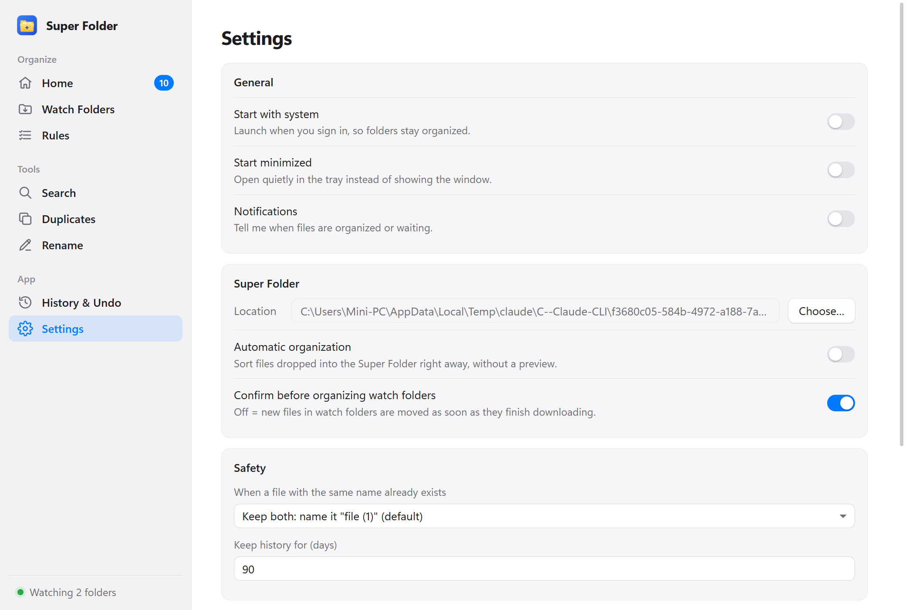

# Super Folder

A tiny offline desktop app that keeps your folders organized.

Put files into one folder, the **Super Folder**, and they get sorted into `Images`, `Documents`, `Videos` and so on by simple rules you control. It can also watch folders like Downloads and Desktop in the background.

- **Offline and private.** No account, no cloud, no telemetry, no AI. Nothing leaves your computer.
- **Safe.** You see a preview before anything moves. It never deletes and never overwrites by default, and every move can be undone.
- **Small.** Built with Tauri and Rust; the installer is a few MB.



| Preview before moving (dark mode) | Simple rules | Settings |
|---|---|---|
|  |  |  |

## Features

| | |
|---|---|
| **Super Folder** | Drop files in (or onto the window) and they're sorted into category folders. |
| **Watch folders** | Watch Downloads, Desktop or any folder. New files are picked up once they've finished downloading. |
| **Simple rules** | "IF file name contains *invoice* THEN move to *Documents/Invoices*". Conditions: extension, file name, file type, size, created and modified date. |
| **Preview** | "Organize 12 files?" with every move listed. Cancel or Organize. |
| **Undo** | Every batch is recorded; History puts files back where they were. |
| **Duplicates** | Finds identical files (size + SHA-256). Shows them; never deletes. |
| **Search** | `invoice`, `*.pdf`, `large files`, `type:video`, `size:>10mb`, `modified:2026-09`, `folder:scans`. |
| **Rename** | Templates like `{date}_{original_name}` with a preview, undoable from History. |
| **Tray** | Runs quietly in the tray / menu bar: Organize Now, Pause, Open, Exit. |
| **Rules import/export** | Share a `rules.json` with others. |

## Install

Download the latest installer from [Releases](../../releases):

| Platform | File | Notes |
|---|---|---|
| Windows 10/11 | `Super.Folder_x.y.z_x64-setup.exe` | Installs for the current user, no admin needed. |
| macOS (Apple Silicon) | `Super.Folder_x.y.z_aarch64.dmg` | |
| macOS (Intel) | `Super.Folder_x.y.z_x64.dmg` | |
| Linux | `.AppImage` (any distro) or `.deb` (Ubuntu/Debian) | |

**The builds are not code-signed yet**, so your system will warn the first time:

- **Windows:** SmartScreen says "Windows protected your PC". Click **More info → Run anyway**.
- **macOS:** right-click the app in Applications → **Open** → **Open**. If macOS says the app "is damaged", run `xattr -dr com.apple.quarantine "/Applications/Super Folder.app"` once.
- **Linux AppImage:** `chmod +x Super.Folder_*.AppImage` then run it. The tray icon needs an AppIndicator-capable desktop (GNOME needs the *AppIndicator* extension).

## Getting started

1. Open Super Folder. It asks where your Super Folder should live (default: `Super Folder` in your home folder).
2. Drop some files in. Home shows **N files waiting**: press **Organize Files**, check the preview, press **Organize**.
3. Optional: add watch folders, create rules, and turn on **Start with system** in Settings.

Closing the window keeps Super Folder running in the tray. Use **Exit** in the tray menu to quit.

## How files are sorted

Rules are checked in this order; the first match wins:

1. **File name rules** (e.g. name contains "invoice")
2. **Custom rules** (any mix of conditions, all must match)
3. **Extension rules** (e.g. extension is pdf)
4. **Default category** by file type

Within each group you can reorder rules. Default categories:

| Folder | Examples |
|---|---|
| Images | jpg, png, gif, webp, heic, raw, psd, svg |
| Videos | mp4, mkv, mov, avi, webm |
| Audio | mp3, wav, flac, m4a, ogg |
| Documents | pdf, docx, txt, md, rtf, odt, epub |
| Spreadsheets | xlsx, xls, csv, ods, numbers |
| Presentations | pptx, ppt, key, odp |
| Archives | zip, 7z, rar, tar, gz |
| Applications | scripts and portable apps: bat, ps1, sh, py, jar, AppImage |
| Installers | exe, msi, pkg, deb, rpm, apk |
| Disk Images | iso, img, dmg, vhd(x), vmdk |
| Code | source and config files: js, rs, py, json, yaml, html, css |
| Other | everything else |

**Super Folder vs watch folders:** files in the Super Folder that no rule matches go to `Other`. Files in a watch folder that no rule matches **stay where they are** and show under *Needs attention*, so the app never sweeps your Downloads into `Other`.

### Rules file format

Export and import rules as JSON (Rules → Export / Import):

```json
{
  "version": 1,
  "rules": [
    {
      "id": "invoices",
      "name": "Invoices",
      "enabled": true,
      "kind": "filename",
      "conditions": [
        { "field": "extension", "op": "is", "value": "pdf" },
        { "field": "filename", "op": "contains", "value": "invoice" }
      ],
      "destination": { "type": "custom", "path": "Documents/Invoices" }
    }
  ]
}
```

| Field | Values |
|---|---|
| `kind` | `filename`, `custom`, `extension` (the priority group) |
| `conditions[].field` | `extension`, `filename`, `type`, `size_mb`, `created`, `modified` |
| `conditions[].op` | `is`, `contains`, `in` (list), `gt`, `gte`, `lt`, `lte` |
| `conditions[].value` | text, a list of text, a number (MB), or a date `YYYY-MM-DD` |
| `type` values | `image`, `video`, `audio`, `document`, `spreadsheet`, `presentation`, `archive`, `application`, `installer`, `disk_image`, `code`, `other` |
| `destination` | `{ "type": "category", "category": "documents" }` or `{ "type": "custom", "path": "…" }` (relative paths are inside the Super Folder) |

All conditions in a rule must match. A rule with no conditions never matches.

## Safety

- Never deletes files. Never overwrites by default: an existing `file.pdf` makes the new one `file (1).pdf`.
- Other conflict choices: **Skip**, **Replace** (the old file is set aside so Undo can bring it back) or **Ask**.
- Waits until a download has finished (size stable for a moment; `.crdownload`, `.part`, `.tmp` are ignored).
- Retries locked files, and reports permission errors and disconnected drives without stopping the batch.
- Only files directly in the Super Folder or a watch folder are organized. Subfolders, including your own folders, are never touched.
- Hidden and system files (`desktop.ini`, `Thumbs.db`, `.DS_Store`, Office `~$` lock files) are left alone.
- Symbolic links are moved as links, never followed. A folder can't be moved into itself, and the Super Folder and watch folders can't be inside one another.
- Unicode file names and large files are handled.

## Where data lives

Settings, rules and history are plain JSON in:

- Windows: `%APPDATA%\super-folder\`
- macOS: `~/Library/Application Support/super-folder/`
- Linux: `~/.config/super-folder/`

Files: `settings.json`, `rules.json`, `history.jsonl`, and `quarantine/` (files replaced under the *Replace* policy, so Undo can restore them). Deleting the folder resets the app.

## Troubleshooting

| Problem | Fix |
|---|---|
| Files in a watch folder aren't moving | Check the folder is enabled on *Watch Folders*, monitoring isn't paused, and look under *Needs attention* (no rule matched?). With *Confirm before organizing* on, press **Organize Files** on Home. |
| A file shows "move failed" | It was open in another program or you don't have permission. Close it and try again. |
| Network drives aren't watched reliably | The OS doesn't report changes on network shares consistently. Use **Organize Now** instead. |
| No tray icon on Linux | Install an AppIndicator extension (GNOME) or use a desktop with tray support. |
| Something went wrong after organizing | Open **History & Undo** and press **Undo** on that batch. |

## Development

Requirements: [Rust](https://rustup.rs) (stable), Node.js 20+, and the [Tauri prerequisites](https://v2.tauri.app/start/prerequisites/) for your OS.

```bash
npm install
npm run tauri dev       # run the app with hot reload
npm run tauri build     # build installers into src-tauri/target/release/bundle/
```

Project layout:

```
src/                          React + TypeScript UI (pages, components, typed API)
src-tauri/src/                Tauri shell: commands, tray, background watcher
src-tauri/crates/sf-engine/   The engine: pure Rust, no Tauri, fully tested
```

The engine works without the UI. Its CLI is handy for testing:

```bash
cd src-tauri
cargo test -p sf-engine
cargo run -p sf-engine --example cli -- plan ~/Downloads
cargo run -p sf-engine --example cli -- search ~/Documents "*.pdf size:>1mb"
```

Set `SUPER_FOLDER_DATA_DIR` to use a separate data folder while testing.

## License

[MIT](LICENSE)
